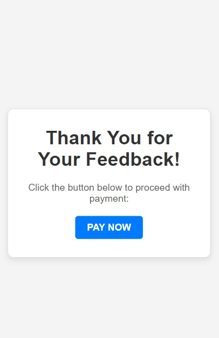

# 🌟 **Feedback & Payment Integration using Razorpay**  
A Node.js application that integrates a feedback form with a Razorpay payment gateway for collecting user feedback and processing payments securely.  

---

## ✨ **Features**  
- ⭐ **Star-Based Feedback**: Collect user ratings on a scale of 1 to 5.  
- 💰 **Payment Gateway**: Razorpay integration for secure and efficient payment processing.  
- 🔒 **Payment Verification**: Ensures secure and reliable payment transactions using Razorpay's signature verification.  
- 📱 **Responsive Design**: User-friendly forms with a clean and modern interface.  

---

## 🛠️ **Technologies Used**  
- **Node.js**: Backend framework.  
- **Express.js**: Web application framework.  
- **Razorpay SDK**: Payment gateway integration.  
- **HTML/CSS**: Frontend for feedback and payment forms.  

---

## ⚙️ **Requirements**  
Ensure the following are installed:  
- [Node.js](https://nodejs.org/) (v14 or later)  
- [Razorpay Account](https://razorpay.com/) for generating API credentials.  

---

## 🚀 **Setup Instructions**  

### 1️⃣ Clone the Repository  
```bash
git clone https://github.com/Lakshmish0/CODEATHON-CASHFLOW.AI.git
cd "Cashflow CQR"
```
### 2️⃣ Install Dependencies
```bash
npm install
```
### 3️⃣ Set Up Environment Variables
Create a .env file in the root directory and add:
``` env
RAZORPAY_KEY_ID=your_key_id
RAZORPAY_KEY_SECRET=your_key_secret
```
Replace **your_key_id** and **your_key_secret** with your Razorpay credentials.
### 4️⃣ Start the Server
```bash
node app.js
```
Visit the application at: **http://localhost:3000**

---

## 📜 Usage
### ⭐ Feedback Form
1. Navigate to the root URL (/).
2. Provide a star rating (1-5) and enter the payment amount.
3. Submit the form to proceed to the payment page.
### 💳 Payment Processing
1. On submission, a Razorpay order is created.
2. Complete the payment using the Razorpay checkout interface.
3. Payment status (Success/Failure) is displayed upon completion

---

## 📷 Screenshots
**Feedback Form**


**PayNow Page**



**Payment Processing**

 

**Payment Processed**

  

**Payment Successful**


 
---

### 🎥 Demo Video
**Watch Demo Below:**
[Watch Demo Video](cashflow_cqr.mp4)

---

## 🤝 Contributing
**Contributions are welcome!**

1. Fork the repository.
2. Create a new branch 
```
git checkout -b feature/your-feature
```
3. Commit your changes 
```
git commit -m "Add your feature"
```
4. Push to the branch 
```
git push origin feature/your-feature
```
5. Open a Pull Request.

---