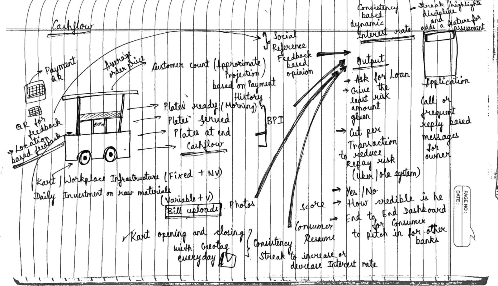

# Cashflow.AI: Bridging Financial Inclusion through AI

 

 

---

## 🌟 **Introduction**

**Welcome to Cashflow.AI!**  
A revolutionary fintech solution conceptualized and developed during the **24-hour Fintech AI & Data Science Codeathon**, hosted by the **IIITB Innovation Centre**, in collaboration with **Reserve Bank Innovation Hub (RBIH)** and sponsored by **Canara Bank**.  

This hackathon united data scientists, innovators, and fintech enthusiasts to tackle real-world banking challenges, competing for a prize pool of ₹3.25 Lakhs.  

---

## 🔥 **Event Highlights**

- **Organizer:** IIITB Innovation Centre  
- **Partners:** RBIH and Canara Bank  
- **Duration:** 24 hours of intense problem-solving  
- **Objective:** Foster financial inclusion through AI and data science  
- **Theme:** *"Leap into the future of fintech!"*  

---

## 🛠️ **Problem Statement: AI-Driven Credit Access for Nano-Entrepreneurs**

**The Challenge**:  
Enable formal credit access for **nano-entrepreneurs** like vegetable vendors and kirana store owners, who often lack sufficient documentation and are considered "thin-file" customers by financial institutions.  

**Key Objectives**:  
1. Use alternative data sources (transaction patterns, business performance, etc.) to assess creditworthiness.  
2. Develop transparent, efficient AI models for loan assessments.  
3. Support diverse loan categories.  
4. Empower customers to own their financial data.

---

## 💡 **Our Solution: Cashflow.AI**

Cashflow.AI is a **suite of AI-powered tools** designed to empower unbanked nano-entrepreneurs with fair and transparent access to formal credit systems.  

### **Core Tools & Their Impact**

1. **Cashflow Scheme Suggest**  
   - **Functionality:** Identifies government schemes relevant to users.  
   - **Impact:** Facilitates access to financial support through welfare programs.

2. **Cashflow CQR (Credibility QR)**  
   - **Functionality:** Collects real-time feedback via payment-linked QR codes.  
   - **Impact:** Builds a credibility score to enhance trust among lenders.

3. **Cashflow CAM (Credit Assessment Model)**  
   - **Functionality:** Analyzes cash flow, business performance, and alternative metrics using AI.  
   - **Impact:** Predicts loan eligibility and suggests tailored loan amounts across categories.

---

## 🌟 **Key Features**

- **Inclusivity:** Accessible to diverse income groups and literacy levels.  
- **Transparency:** AI-driven, data-backed credit assessments.  
- **Scalability:** Suitable for deployment in both urban and rural areas.  
- **Consumer Empowerment:** Ensures customer ownership of financial data.  

---

## 🚀 **How It Works**

1. **Data Collection**:  
   Collects transaction patterns, business metrics, and social references.  

2. **Credit Scoring**:  
   Leverages AI to analyze collected data and predict creditworthiness.  

3. **Loan Recommendation**:  
   Provides tailored loan solutions, considering the specific needs of nano-entrepreneurs.  

---

## 🤝 **Join Us in Bridging the Gap!**

Cashflow.AI is a step towards **financial inclusion**, providing nano-entrepreneurs with the tools they need to thrive. Together, we can empower millions to achieve their entrepreneurial dreams and uplift local economies.

---

### 🌐 **Collaborators!**
  
- [Sujay D](https://github.com/SujaydRNSIT) - https://github.com/SujaydRNSIT  
- [Shrihari U K](https://github.com/Unplugged-Sirius) - https://github.com/Unplugged-Sirius
- [Vishwa Hegde](https://github.com/vishwahegdek) - https://github.com/vishwahegdek
- [Lakshmish](https://github.com/Lakshmish0) - https://github.com/Lakshmish0

---

## 📝 **License**

This project is licensed under the [MIT License](LICENSE).

---
Our Base Plan

  